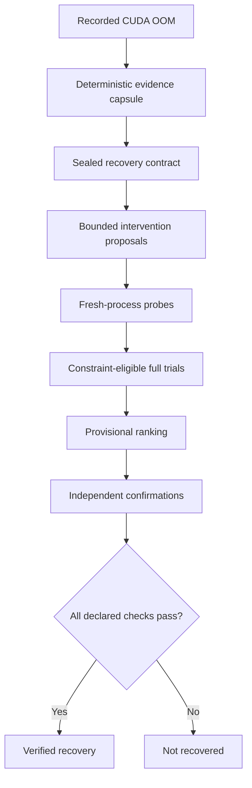

# WatcherML

[](https://pypi.org/project/watcherml/)
[](https://pypi.org/project/watcherml/)
[](https://github.com/Rohan5manza/WatcherML/actions/workflows/ci.yml)
[](LICENSE)

**Recovery and forensics layer for ML experiments**

WatcherML is a local-first Python SDK and CLI that records ML runs, captures a structured evidence capsule when a run fails, and investigates CUDA out-of-memory failures through bounded, isolated trials.

It calls a recovery **verified** only after independent confirmation runs satisfy constraints declared before recovery compute begins.

> **Current scope — v0.1:** WatcherML records successful and failed experiments and deterministically recognizes several common failure classes. Its automated recovery protocol is deliberately narrower: **CUDA OOM during training is the first fully implemented and verifiable vertical.**

* Website: [watcherml.rohanmarar.com](https://watcherml.rohanmarar.com)
* Package: [pypi.org/project/watcherml](https://pypi.org/project/watcherml/)
* Issues: [GitHub Issues](https://github.com/Rohan5manza/WatcherML/issues)

---

## Installation

WatcherML requires Python 3.10 or newer.

### Core SDK and CLI

```bash
python -m pip install watcherml
```

### Jupyter and IPython support

```bash
python -m pip install "watcherml[notebook]"
```

### Local web UI

```bash
python -m pip install "watcherml[ui]"
```

### Notebook integration and UI

```bash
python -m pip install "watcherml[notebook,ui]"
```

The core install includes the recorder, deterministic capsules, recovery engine, SQLite storage, and CLI. Its only direct runtime dependency is `psutil`.

WatcherML does **not** install PyTorch or CUDA. Keep the framework and NVIDIA stack appropriate for your machine or Colab runtime.

Verify the environment:

```bash
python -c "import watcherml; print(watcherml.__version__)"
watcher doctor
```

`watcher doctor` checks storage, the SQLite schema, isolated trial worker, PyTorch, and CUDA. CUDA may be unavailable while recorder and CPU features remain usable.

The executables `watcher` and `watcherml` are equivalent. This README uses `watcher`.

---

## Massively improve your ML workflows

With the advent of AI dev in today's world, running multiple ML runs for a project has become routine. However, understanding why a run failed on your GPU cluster, which intervention recovered it,
and whether that recovery can be trusted, remains painfully manual.

CUDA OOM errors are arguably the most common bottleneck in AI dev. They can erase hours, or even days, of GPU training.

A manual retry can make a CUDA OOM disappear. That does not necessarily tell a team:

* what state the failed process was in;
* which evidence supports the diagnosis;
* exactly what changed in the retry;
* whether the new run completed enough work to be meaningful;
* whether model quality regressed;
* whether the result survives a fresh process more than once; or
* whether the claimed fix belongs to the same code, data, model, and recovery contract.

WatcherML turns that informal retry loop into an inspectable protocol:



The output is not merely “batch size 16 worked.” It is a durable audit trail linking the source failure, evidence, proposed intervention, process-isolated executions, metric constraints, resource observations, and confirmation verdict.

---

## Why WatcherML exists

Experiment trackers record parameters and metrics. Training frameworks execute models. Hyperparameter optimizers search objectives. None of those roles automatically gives an OOM recovery claim a strict chain of evidence.

WatcherML is a **reliability and recovery layer**, not a replacement for the rest of the ML stack. It is designed to sit beside PyTorch, Jupyter, NVIDIA tooling, and—in future versions—the tracking system a team already uses.

It is most useful when:

* GPU runs are expensive or slow to reproduce;
* several engineers need to understand the same failure;
* retries need fixed compute and risk limits;
* changing sequence length, precision, offloading, or optimizer state requires review;
* a successful retry must also preserve quality and workload identity;
* the team wants machine-readable evidence for CI or incident review; or
* work begins in a notebook but needs to become a repeatable process.

For a one-off experiment with an obvious OOM, manually lowering the batch size may be faster. WatcherML earns its keep when **the reasoning, limits, repeatability, and proof matter as much as getting one green run**.

## What WatcherML is—and is not

| WatcherML is                              | WatcherML is not                                             |
| ----------------------------------------- | ------------------------------------------------------------ |
| A local run and failure flight recorder   | A hosted experiment-tracking service                         |
| A deterministic failure-capsule generator | An LLM root-cause oracle                                     |
| A bounded CUDA OOM intervention protocol  | General hyperparameter optimization                          |
| A fresh-process trial runner              | A Docker or Kubernetes sandbox                               |
| A constraint-first candidate evaluator    | A guarantee that the statistically best model was found      |
| An independent confirmation verifier      | Automatic production promotion or deployment                 |
| A companion to an existing ML stack       | A replacement for PyTorch, MLflow, W&B, DVC, or NVIDIA tools |

WatcherML does not modify source code, install dependencies, change datasets, deploy models, or silently continue training. It executes an importable training entrypoint with JSON configuration changes that pass capability, policy, contract, and authorization checks.

---

## Design philosophy

1. **Evidence before explanation.** The durable source of truth is captured state: configuration, traceback, progress, telemetry, framework/GPU context, code state, environment, metric history, dataset fingerprint, and notebook history when available.

2. **Deterministic trust path.** Failure classification, capability validation, proposals, budgets, ranking eligibility, and verification are deterministic. v0.1 has no Ollama, hosted model, or hidden AI fallback.

3. **Declare success before searching.** A recovery contract fixes compute, regression limits, progress, optional VRAM ceilings, identity, and permissions before trials begin.

4. **Narrow authority.** Discovering a control does not authorize changing it. Broader or semantic changes require campaign permission and proposal-specific approval.

5. **Fresh processes and inspectable runs.** Every probe, full trial, and confirmation is a new Python subprocess and a normal WatcherML run. Docker is not implied.

6. **Ranking is not verification.** Ranking only orders eligible candidates for confirmation. Only the verifier can issue a recovery verdict.

7. **Fail closed.** Missing results, malformed artifacts, identity mismatches, duplicate identifiers, timeouts, insufficient progress, or missing metrics cannot become “probably successful.”

8. **Local-first and portable.** SQLite metadata and artifacts live under `.watcherml/` by default; exported capsules contain checksummed evidence.

9. **Honest boundaries.** Verified means the declared contract passed for recorded confirmations—not that every root cause is proven or every future workload will succeed.


WatcherML does more than retry configurations until one run succeeds. It makes recovery bounded, reproducible, and trustworthy. Its architecture was designed keeping this necessary strictness in mind. 

Each component prevents a real problem: captured evidence replaces guesswork, recovery contracts define success before testing, fresh processes prevent state leakage, permissions restrict unsafe changes, and independent confirmation prevents a promising trial from being presented as a verified fix. 

For expensive GPU jobs, recurring failures, and fixes that ML teams must trust, it is the minimum needed to distinguish “this worked once” from “this recovery passed clear constraints and succeeded repeatedly.”

---

## Five-minute recording quickstart

```python
import watcherml as watcher

config = {
    "model": "resnet50",
    "batch_size": 64,
    "learning_rate": 2e-4,
    "training_steps": 1_000,
}

with watcher.init(project="tomato-disease", config=config) as run:
    run.set_dataset("./data/tomato")

    for step in range(config["training_steps"]):
        loss = train_one_step(...)
        run.log_metric("train_loss", loss, step=step)

        if step % 100 == 0:
            run.log(
                {"validation_loss": evaluate(...)},
                step=step,
            )

    run.log_artifact("./checkpoints/final.pt")
```

If training raises, WatcherML persists the failure and re-raises the original exception. It does not hide the crash.

On success it prints a receipt containing the run ID, final metrics, duration, peak VRAM when available, Git state, dataset fingerprint, and reproduction completeness.

```bash
watcher runs --project tomato-disease
watcher inspect RUN_ID
watcher failures --project tomato-disease
```

## What recording captures

* project and JSON-serializable configuration;
* start/end times and exit status;
* Git commit, branch, dirty state, and working-tree patch when available;
* Python, platform, and installed-package environment;
* GPU hardware, driver, CUDA/framework context when available;
* periodic CPU, RAM, GPU utilization, and VRAM samples;
* metrics, steps, and timestamps;
* artifact references, sizes, and checksums;
* dataset fingerprint when `run.set_dataset(...)` is used; and
* notebook cell source/order when the extension is active.

The background sampler is best-effort: a telemetry write problem never crashes training.

### Public `Run` methods

| Method                                             | Purpose                                             |
| -------------------------------------------------- | --------------------------------------------------- |
| `watcher.init(project, config=None, storage=None)` | Start and return a new `Run`                        |
| `run.set_dataset(path)`                            | Compute and attach a dataset fingerprint            |
| `run.log_metric(name, value, step=None)`           | Store one numeric metric                            |
| `run.log(metrics, step=None)`                      | Store a dictionary of numeric metrics               |
| `run.log_artifact(path)`                           | Record an artifact reference, size, and checksum    |
| `run.finish()`                                     | Explicitly finish a notebook-style run successfully |

`Run.start()` is available when constructing `Run` directly, but `watcher.init(...)` with a context manager is recommended.

---

## Failure capsules

A capsule is a versioned, machine-readable snapshot containing the exception, traceback, deterministic classification, evidence, training state, configuration, recent metrics, resources, GPU/framework state, Git/environment provenance, dataset/notebook evidence when available, and capture completeness.

### Stable evidence IDs

| ID      | Evidence            | Plain-language meaning                              |
| ------- | ------------------- | --------------------------------------------------- |
| `EV-1`  | Run configuration   | Parameters supplied to the failed run               |
| `EV-2`  | Last training state | Last step, batch information, and recorded progress |
| `EV-3`  | Process/runtime     | Process and runtime facts at failure time           |
| `EV-4`  | Resource sampler    | CPU, RAM, GPU, and VRAM observations                |
| `EV-5`  | GPU information     | Hardware, driver, and device facts                  |
| `EV-6`  | Framework state     | Framework, CUDA, and allocator context              |
| `EV-7`  | Git state           | Commit, branch, and uncommitted changes             |
| `EV-8`  | Environment         | Python and installed-package fingerprint            |
| `EV-9`  | Dataset fingerprint | Identity signal for the dataset                     |
| `EV-10` | Metric history      | Recent metric values and steps                      |
| `EV-11` | Notebook history    | Executed cells and order when available             |

Missing evidence stays missing. WatcherML does not invent fields to improve completeness.

### Deterministic failure classes

| Rule                               | Meaning                              |            Automated recovery? |
| ---------------------------------- | ------------------------------------ | -----------------------------: |
| `cuda_out_of_memory`               | CUDA/GPU memory was exhausted        | **Yes—v0.1 recovery vertical** |
| `nan_or_exploding_loss`            | Loss became NaN or diverged          |               No; inspect only |
| `tensor_shape_mismatch`            | Tensor dimensions did not match      |               No; inspect only |
| `missing_file_or_dataset_path`     | A required path was missing          |               No; inspect only |
| `dataloader_worker_failure`        | A DataLoader worker crashed          |               No; inspect only |
| `device_mismatch`                  | Tensors used incompatible devices    |               No; inspect only |
| `dependency_or_cuda_compatibility` | Dependency, driver, or CUDA mismatch |               No; inspect only |
| `unclassified`                     | No deterministic rule matched        | No; evidence remains available |

Classification is a useful operational label, not a mathematical proof of root cause.

---

## Jupyter and Google Colab

```python
%pip install "watcherml[notebook]"
%load_ext watcherml
%watcher project colab-oom-demo
```

```python
import watcherml as watcher

run = watcher.init(config={
    "model": "my-model",
    "batch_size": 32,
    "gradient_accumulation_steps": 1,
    "training_steps": 500,
})
run.set_dataset("/content/data")
```

Use `run.log_metric(...)` or `run.log(...)` across cells, then call `run.finish()`.

If a later cell raises while the run is active, the extension records that cell failure and saves the capsule automatically.

| Magic                   | Purpose                                      |
| ----------------------- | -------------------------------------------- |
| `%watcher project NAME` | Set the default project for `watcher.init()` |
| `%watcher status`       | Show the active run and recorded cell count  |

Recovery must be reconstructable in fresh processes. Put its callable in a file:

```python
%%writefile train_entrypoint.py

def train(config: dict, max_steps: int | None = None) -> dict[str, float]:
    # Recreate dataset, model, optimizer, and training state here.
    ...
```

Use `train_entrypoint:train`, not `train_entrypoint.py:train`.

Notebook globals, lambdas, closures, bound methods, and an existing CUDA process cannot serve as recovery entrypoints.

Colab should use the SDK or CLI. Download `.watcherml` after the campaign to inspect it later in a local UI.

---

## CUDA OOM recovery guide

### Concepts

| Term                    | Meaning                                                       |
| ----------------------- | ------------------------------------------------------------- |
| **Source run**          | Original recorded deterministic CUDA OOM                      |
| **Capsule**             | Sealed failure evidence                                       |
| **Capability**          | Typed configuration control the entrypoint supports           |
| **Intervention**        | One bounded change to a capability                            |
| **Proposal**            | Suggested intervention that has not run                       |
| **Authorization**       | Human approval bound to one exact proposal                    |
| **Recovery contract**   | Immutable compute, change, identity, and success rules        |
| **Campaign**            | Bounded probes, full trials, confirmations, and audit records |
| **Probe**               | Short `max_steps`-capped rejection test                       |
| **Full trial**          | Normal-length execution of a surviving candidate              |
| **Provisional ranking** | Candidate ordering; not a verdict                             |
| **Confirmation**        | Fresh rerun of the selected candidate                         |
| **Verified recovery**   | Complete confirmations passed all contract checks             |

### 1. Capture the source OOM

The source run must be recorded by WatcherML and classified as `cuda_out_of_memory`. Its configuration becomes the baseline.

### 2. Create an importable training entrypoint

Create `train_entrypoint.py`:

```python
from __future__ import annotations


def train(
    config: dict,
    max_steps: int | None = None,
) -> dict[str, float]:
    configured_steps = int(config["training_steps"])

    steps_to_run = (
        min(configured_steps, max_steps)
        if max_steps is not None
        else configured_steps
    )

    # Rebuild these inside every subprocess.
    dataset = build_dataset(config)
    model = build_model(config)
    optimizer = build_optimizer(model, config)

    completed = 0

    for _ in range(steps_to_run):
        train_one_step(model, optimizer, dataset, config)
        completed += 1

    return {
        "steps_completed": float(completed),
        "validation_loss": float(evaluate(model, dataset)),
    }
```

The contract requires:

* `module.path:function_name` syntax;
* a top-level importable callable;
* parameters named `config` and `max_steps` for recovery;
* finite, JSON-round-trippable configuration no larger than 1 MB in v0.1;
* `None` or a mapping of non-empty names to finite real metrics; and
* guarded metrics plus `steps_completed`, or a configured progress metric, from full and confirmation runs.

`max_steps` makes a probe provably short. WatcherML rejects an unbounded entrypoint rather than silently using full training as a probe.

```python
import watcherml as watcher

spec = watcher.TrainingEntrypoint("train_entrypoint:train")

print(
    watcher.validate_entrypoint(
        spec,
        project_root=".",
        require_max_steps=True,
    )
)
```

### 3. Define recovery success before running trials

```python
import watcherml as watcher

verification = watcher.VerificationRequirements(
    minimum_progress_steps=1_000,
    metric_guards=(
        watcher.MetricGuard(
            name="validation_loss",
            direction="minimize",
            baseline_value=0.42,
            max_regression=0.03,
        ),
    ),
    confirmation_runs=2,
    max_peak_vram_bytes=14 * 1024**3,
    workload_identity=watcher.WorkloadIdentity(
        dataset_fingerprint="CAPTURED_FINGERPRINT",
        model_identifier="example-transformer",
    ),
)

budget = watcher.RecoveryBudget(
    max_trials=6,
    max_probe_trials=3,
    max_full_trials=1,
    probe_steps=30,
    trial_timeout_seconds=3_600,
    campaign_timeout_seconds=14_400,
    max_gpu_seconds=7_200,
)
```

For `minimize`, `baseline + max_regression` is the maximum accepted value. In this example, it is `0.45`.

For `maximize`, `baseline - max_regression` is the minimum. `target_value` can make the boundary stricter.

Confirmations consume budgets, so:

```text
max_probe_trials + max_full_trials + confirmation_runs <= max_trials
```

v0.1 hard-caps campaigns at 10 trials and confirmations at 3. Every non-null workload identity field must match exactly.

### 4. Run automatic low-risk proposals

```python
result = watcher.recover_from_oom(
    failed_run_id="oom-demo-SOURCE_RUN_ID",
    entrypoint="train_entrypoint:train",
    verification=verification,
    budget=budget,
    project_root=".",
    include_approval_required=False,
)

if result.verified:
    print("Verified candidate:", result.verified_candidate_id)
    print("Confirmation runs:", result.verified_run_ids)
else:
    print("No verified recovery within the contract.")
```

### 5. Review broader proposals with the two-stage API

Preparation performs zero recovery trial compute:

```python
permissions = watcher.InterventionPermissions(
    allow_approval_required=True,
    allow_semantic_changes=False,
    allow_high_risk=False,
)

preparation = watcher.prepare_oom_recovery(
    failed_run_id="oom-demo-SOURCE_RUN_ID",
    entrypoint="train_entrypoint:train",
    verification=verification,
    budget=budget,
    permissions=permissions,
    project_root=".",
    include_approval_required=True,
)

for proposal in preparation.policy_plan.proposals:
    authority = (
        "automatic"
        if proposal.proposal_id in preparation.automatic_proposal_ids
        else "approval_required"
    )

    print(
        proposal.proposal_id,
        authority,
        proposal.policy_rule,
    )

proposal_id = preparation.approval_required_proposal_ids[0]

authorization = preparation.authorize(
    proposal_id,
    approved_by="engineer@example.com",
    reason="Reviewed quality and runtime trade-offs.",
)

result = watcher.run_prepared_recovery(
    preparation,
    authorizations={
        proposal_id: authorization,
    },
    project_root=".",
)
```

Campaign permission is a ceiling, not an approval. An approval-required proposal runs only when contract permission and exact proposal authorization both exist.

---

## Intervention scope

WatcherML discovers canonical capabilities from known aliases or explicit declarations. Ambiguous aliases are not guessed.

| Capability                    | Common aliases                              | Default authority                | Intended effect                          |
| ----------------------------- | ------------------------------------------- | -------------------------------- | ---------------------------------------- |
| `micro_batch_size`            | `batch_size`, `per_device_train_batch_size` | Automatic, low risk              | Lower activation memory                  |
| `gradient_accumulation_steps` | same name, `accumulate_grad_batches`        | Automatic, low risk              | Preserve effective batch                 |
| `gradient_checkpointing`      | same name, `activation_checkpointing`       | Automatic, low risk              | Trade compute for activation memory      |
| `sequence_length`             | `max_seq_length`, `block_size`              | Approval; semantic               | Reduce attention/activation growth       |
| `precision`                   | `mixed_precision`, `torch_dtype`            | Approval; semantic               | Use supported lower-memory compute       |
| `attention_backend`           | `attn_implementation`, `attn_impl`          | Approval                         | Select efficient attention kernel        |
| `memory_efficient_attention`  | `use_memory_efficient_attention`            | Approval                         | Reduce attention intermediates           |
| `activation_offload`          | `offload_activations`                       | Approval                         | Trade host RAM and transfers for VRAM    |
| `optimizer_state_offload`     | `offload_optimizer`                         | Approval                         | Move optimizer state from VRAM           |
| `parameter_offload`           | `offload_parameters`                        | Approval; high risk              | Move parameters from VRAM                |
| `optimizer_bits`              | `optim_bits`                                | Approval; high risk and semantic | Reduce optimizer-state memory            |
| `model_cache`                 | `use_cache`, `kv_cache`                     | Approval                         | Disable training-time cache              |
| `allocator_configuration`     | `PYTORCH_CUDA_ALLOC_CONF`                   | Approval                         | Address supported fragmentation evidence |

This is an allowlisted vocabulary, not a promise that every campaign proposes every item.

The plan depends on source configuration, discovered capabilities, and evidence. Declarations may make permissions stricter, never weaker.

## Trials, ranking, verification, and compute

1. **Probe:** a fresh subprocess with `max_steps=probe_steps`. It rejects obvious failures cheaply and cannot be verified.

2. **Full trial:** a normal-length execution for a probe survivor. It must produce the required progress and metrics.

3. **Constraint filtering:** trials violating the contract are ineligible.

4. **Provisional ranking:** deterministic lexicographic ordering selects confirmation order. It is not a verdict.

5. **Confirmation:** distinct fresh processes rerun the exact candidate.

6. **Verification:** requires exact contract, source, candidate, and configuration bindings; unique trial, run, request, and execution IDs; successful outcomes; minimum progress; every metric guard; optional VRAM ceiling; workload identity; and a complete confirmation set.

Only the verifier can set `verified` with reason `verified_recovery`.

Trials are sequential local Python subprocesses by default—not containers. They inherit the machine, environment, permissions, filesystem, and visible GPU.

The compute ceiling is:

```text
probe trials + full trials + confirmations <= max_trials
```

Actual use may be lower. Trial timeout, campaign timeout, and optional GPU seconds are additional limits.

Every process rebuilds the framework, model, and data, so probes still have startup cost.

---

## Complete Python SDK reference

These are the supported top-level v0.1 symbols.

| Symbol                                                        | Role                                                 |
| ------------------------------------------------------------- | ---------------------------------------------------- |
| `watcherml.init(project=None, config=None, storage=None)`     | Start a recorded run                                 |
| `watcherml.Run`                                               | Experiment lifecycle and logging                     |
| `watcherml.Storage`                                           | Local metadata and artifact interface                |
| `watcherml.TrainingEntrypoint(target, working_directory=".")` | Portable callable reference                          |
| `watcherml.validate_entrypoint(...)`                          | Validate import and signature                        |
| `watcherml.MetricGuard`                                       | Metric direction, baseline, regression, and target   |
| `watcherml.RecoveryBudget`                                    | Trial, probe, time, and GPU limits                   |
| `watcherml.VerificationRequirements`                          | Progress, metrics, confirmations, VRAM, and identity |
| `watcherml.WorkloadIdentity`                                  | Dataset, environment, Git, and model binding         |
| `watcherml.InterventionPermissions`                           | Campaign authority ceilings                          |
| `watcherml.RecoveryContract`                                  | Immutable campaign contract                          |
| `watcherml.RecoveryPreparation`                               | Serializable zero-compute recovery plan              |
| `watcherml.RecoveryResult`                                    | Campaign result and verifier-backed status           |
| `watcherml.prepare_oom_recovery(...)`                         | Prepare without trial compute                        |
| `watcherml.run_prepared_recovery(...)`                        | Execute a prepared plan                              |
| `watcherml.recover_from_oom(...)`                             | Prepare and execute through one convenience API      |
| `watcherml.__version__`                                       | Installed package version                            |
| `watcherml.CAPSULE_SCHEMA_VERSION`                            | Failure-capsule schema version                       |

`RecoveryPreparation.to_json()` and `RecoveryResult.to_json()` produce validated serialized artifacts.

Their loaders revalidate schemas and bindings rather than trusting redundant status flags.

---

## Complete CLI reference

```text
watcher [GLOBAL_OPTIONS] COMMAND [COMMAND_OPTIONS]
```

Global options appear before the command:

| Option            | Meaning                        |
| ----------------- | ------------------------------ |
| `--data-dir PATH` | WatcherML data directory       |
| `--no-color`      | Disable ANSI colors            |
| `--quiet`         | Suppress human progress output |
| `-h`, `--help`    | Show help                      |

`WATCHERML_DIR` also selects storage. An explicit `--data-dir` wins.

Default storage is `./.watcherml`.

| Command                           | Purpose                                                  | Main options                                                 |
| --------------------------------- | -------------------------------------------------------- | ------------------------------------------------------------ |
| `watcher init`                    | Initialize storage                                       | `--format text\|json`                                        |
| `watcher doctor`                  | Check recorder and CUDA readiness                        | `--format text\|json`                                        |
| `watcher runs`                    | List runs                                                | `--project`, `--status`, `--limit`, `--format`               |
| `watcher inspect RUN_ID`          | Inspect a run or capsule                                 | `--format text\|json\|markdown`, `--output`                  |
| `watcher failures`                | List capsules                                            | `--project`, `--unresolved`, `--format`                      |
| `watcher compare RUN_A RUN_B`     | Structured run diff                                      | `--format`                                                   |
| `watcher export RUN_ID`           | Checksummed portable ZIP                                 | `--out`, `--format`                                          |
| `watcher prepare-recovery RUN_ID` | Sealed zero-compute plan                                 | Contract, policy, and output options                         |
| `watcher recover [RUN_ID]`        | Prepare, authorize, execute, and verify, or use `--plan` | Contract, authorization, and executor options                |
| `watcher recoveries`              | List campaigns                                           | `--project`, `--status`, `--verified`, `--limit`, `--format` |
| `watcher recovery CAMPAIGN_ID`    | Inspect a campaign audit trail                           | `--format`                                                   |
| `watcher ui`                      | Launch local UI                                          | `--host`, `--port`, `--no-browser`                           |

### Everyday commands

```bash
watcher init
watcher doctor

watcher runs --project oom-demo --status failed
watcher inspect RUN_ID
watcher inspect RUN_ID --format json --output failure.json
watcher inspect RUN_ID --format markdown --output failure.md

watcher failures --project oom-demo --unresolved
watcher compare SUCCESS_RUN_ID FAILED_RUN_ID
watcher export FAILED_RUN_ID --out failure-capsule.zip

watcher recoveries --project oom-demo
watcher recoveries --verified
watcher recovery CAMPAIGN_ID
```

### Prepare and run recovery

```bash
watcher prepare-recovery SOURCE_RUN_ID \
  --entrypoint train_entrypoint:train \
  --project-root . \
  --working-directory . \
  --metric validation_loss:minimize:0.42:0.03 \
  --minimum-progress-steps 1000 \
  --confirmation-runs 2 \
  --max-peak-vram-gib 14 \
  --max-trials 6 \
  --max-probe-trials 3 \
  --max-full-trials 1 \
  --probe-steps 30 \
  --trial-timeout 3600 \
  --campaign-timeout 14400 \
  --max-gpu-seconds 7200 \
  --automatic-only \
  --out recovery-plan.json

watcher recover --plan recovery-plan.json --yes
```

Metric syntax:

```text
NAME:DIRECTION:BASELINE:MAX_REGRESSION[:TARGET]
```

Repeat `--metric` for multiple guards.

Supported directions are:

```text
minimize
maximize
```

Identity flags:

```text
--dataset-fingerprint VALUE
--environment-fingerprint VALUE
--git-commit VALUE
--model-identifier VALUE
```

Policy and capability flags:

```text
--max-proposals N
--automatic-only
--allow-approval-required
--allow-semantic-changes
--allow-high-risk
--capabilities declarations.json
```

`--yes` confirms compute but **never approves proposals**.

Bind an approval-required proposal explicitly:

```bash
watcher recover \
  --plan recovery-plan.json \
  --authorize PROPOSAL_ID \
  --approved-by engineer@example.com \
  --approval-reason "Reviewed memory, quality, and runtime trade-offs." \
  --yes
```

Additional execution flags include:

```text
--save-plan FILE
--trials-root DIRECTORY
--progress-metric NAME
--python-executable PATH
--termination-grace SECONDS
--campaign-id ID
--no-approval-prompts
```

The interactive CLI presents:

```text
Observe → Plan → Authorize → Execute → Verify
```

It includes bounded progress and a verifier-aligned summary.

Use `--format json --yes` for automation.

### Exit codes

|  Code | Meaning                                  |
| ----: | ---------------------------------------- |
|   `0` | Success                                  |
|   `1` | General or validation error              |
|   `2` | Invalid CLI usage                        |
|   `3` | Run or campaign not found                |
|   `4` | Campaign ran without a verified recovery |
|   `5` | User declined execution                  |
| `130` | Interrupted                              |

---

## Local web UI

```bash
python -m pip install "watcherml[ui]"
watcher ui
```

Default address:

[http://127.0.0.1:7331](http://127.0.0.1:7331)

```bash
watcher ui \
  --host 127.0.0.1 \
  --port 7331 \
  --no-browser
```

The UI is a local evidence and audit surface.

It supports small metadata actions such as renaming a run or marking a failure resolved, but recovery planning, authorization, and execution stay in the SDK and CLI trust path.

Views include:

* **Overview**
* **Projects**
* **Runs**
* **Failures**
* **Campaigns**
* **Memory**
* **Guide**
* **Settings**

The Guide explains evidence IDs, campaigns, interventions, trial phases, provisional ranking, verification, and GPU cost in plain language.

Inspect downloaded Colab evidence with:

```bash
watcher \
  --data-dir /path/to/downloaded/.watcherml \
  ui
```

Do not expose the v0.1 UI publicly. It is not an authenticated multi-tenant server.

---

## Data, exports, and privacy

Default storage:

```text
.watcherml/
├── watcherml.db
└── artifacts/
    └── CAMPAIGN_ID/
        └── recovery-result.json
```

Select another path:

```bash
watcher --data-dir /path/to/state runs
```

Or:

```bash
export WATCHERML_DIR=/path/to/state
watcher runs
```

Export a run:

```bash
watcher export RUN_ID --out watcher-run.zip
```

Exports contain:

* a `manifest.json` with SHA-256 and size for every payload;
* run and configuration information;
* environment and requirements information;
* a failure capsule when present;
* artifact references and checksums; and
* a Git working-tree patch when captured.

Dataset and checkpoint bytes are **not** embedded. Artifacts are references with checksums.

### Privacy

Local does not mean non-sensitive.

Configurations, tracebacks, notebook source, package lists, paths, and Git patches may reveal private information.

Review capsules before sharing them. Never put secrets in experiment configuration, and protect `.watcherml/` like logs and experiment metadata.

---

## Designed for the stack you already use

| Tool                 | v0.1 relationship                                                           |
| -------------------- | --------------------------------------------------------------------------- |
| **PyTorch**          | Works with PyTorch code and captures framework/CUDA evidence when installed |
| **Jupyter / Colab**  | Optional extension records cell-by-cell work; SDK and CLI run recovery      |
| **NVIDIA / CUDA**    | Captures available GPU, driver, and resource facts and runs real OOM trials |
| **MLflow**           | Can log alongside WatcherML; a native adapter is not included in v0.1       |
| **Weights & Biases** | Can log alongside WatcherML; a native adapter is not included in v0.1       |

WatcherML does not require teams to replace a tracking backend.

Future sinks can forward selected records while local deterministic evidence remains the recovery source of truth.

---

## Architecture

| Layer                                                      | Responsibility                                             |
| ---------------------------------------------------------- | ---------------------------------------------------------- |
| `run.py`, `collectors.py`                                  | Lifecycle, metrics, artifacts, and resource sampling       |
| `capsule.py`, `capsule_schema.py`, `failures.py`           | Evidence and deterministic failure rules                   |
| `entrypoint.py`                                            | Portable callable contract                                 |
| `capabilities.py`                                          | Conservative typed-control discovery                       |
| `oom_policy.py`, `interventions.py`                        | Proposals, validation, and authorization                   |
| `recovery_contract.py`                                     | Immutable limits, constraints, identities, and permissions |
| `trial_protocol.py`, `_trial_worker.py`, `trial_runner.py` | Fresh-process protocol and execution                       |
| `ranking.py`                                               | Constraint-first provisional ordering                      |
| `verifier.py`                                              | Sole recovery-verdict authority                            |
| `campaign.py`, `recovery.py`                               | Orchestration, persistence, and public APIs                |
| `storage.py`                                               | SQLite and local artifacts                                 |
| `cli.py`, `webapp.py`, `webstatic/`                        | Terminal workflow and local UI                             |

This separation prevents proposal generation or UI wording from manufacturing a success claim that does not exist in verifier evidence.

## Campaign statuses

| Status              | Meaning                                                                |
| ------------------- | ---------------------------------------------------------------------- |
| `verified`          | Complete confirmation set passed every contract and integrity check    |
| `not_recovered`     | Bounded campaign completed without a verified candidate                |
| `stopped`           | A budget, timeout, evidence, execution, or fail-closed rule stopped it |
| `integration_error` | Orchestration or persistence failed; no partial recovery claim is made |

A green probe is not a recovered model.

A green full run is provisional.

Only confirmation can create a verified recovery.

---

## Current limitations

* Automated recovery covers deterministic CUDA OOM only.
* Isolation uses local subprocesses, not containers, VMs, cgroups, or Kubernetes.
* Trials inherit the invoking user’s environment, filesystem access, and visible devices.
* v0.1 changes supported configuration and one allowlisted environment variable, not arbitrary code.
* Custom configuration layouts may require capability declarations.
* Verification proves the declared confirmation contract, not universal future behavior.
* The UI has no authentication or multi-user server mode.
* Native MLflow and W&B adapters are not included yet.
* WatcherML is not a scheduler or distributed campaign coordinator.
* Telemetry depends on facts exposed by the operating system, framework, and GPU tooling.

These boundaries are deliberate. Broader intervention scope must retain isolation, authorization, evidence binding, and verification.

Refer to planned Roadmap for what is planned for future versions of watcherml.
---

## Development

```bash
git clone https://github.com/Rohan5manza/WatcherML.git
cd WatcherML

python -m venv .venv
source .venv/bin/activate

python -m pip install --upgrade pip
python -m pip install -e ".[dev,notebook,ui]"

python -m pytest -q
```

Windows PowerShell activation:

```powershell
.venv\Scripts\Activate.ps1
```

Build and check distributions:

```bash
python -m pip install --upgrade build twine
python -m build
python -m twine check dist/*
```

Test the built wheel in a clean environment before publishing—not only through an editable installation.

## Contributing

Contributions are welcome, especially:

* real reproducible CUDA OOM workloads;
* capability mappings;
* stronger isolation;
* verifier invariants;
* notebook and Colab ergonomics;
* MLflow and W&B sinks; and
* accessible CLI and UI explanations.

A new automatic intervention should include:

1. a precise typed capability transition;
2. deterministic evidence that permits it;
3. permission, semantic-change, and risk classification;
4. hard budget behavior;
5. fail-closed tests;
6. persisted audit representation; and
7. verification independent of planner opinion.

Open an issue before a large architectural change so trust boundaries and scope can be discussed.

Email rohanmarar5manza@gmail.com for proposals and new ideas. 
---

## FAQ

### Is WatcherML an SDK?

Yes. The package exposes public Python APIs for recording, storage, entrypoint validation, contracts, campaign execution, and structured results.

The CLI and UI are interfaces over the same package.

### Is it only a hyperparameter (such as batch size) tuner?

No.

Batch size and gradient accumulation are the safest first interventions, but the capability model also includes checkpointing, sequence length, precision, attention backends, offloading, optimizer bits, model cache, and allocator configuration.

Broader changes require stricter authority.

### Why not try configurations manually?

You can for a simple experiment.

WatcherML adds bounded compute, fresh-process execution, preserved evidence, explicit trade-offs, quality and identity constraints, confirmation runs, and a defensible record of the result.

### Does it use Docker?

No.

v0.1 launches fresh local Python subprocesses. This isolates process and CUDA state, not the operating-system security boundary.

### Does it need an LLM?

No.

The v0.1 trust path is deterministic and requires no provider or API key.

### Can it run without a GPU?

Recording, capsule tests, storage, inspection, export, and the UI can.

Real CUDA OOM recovery requires compatible PyTorch, CUDA, and NVIDIA infrastructure plus the bounded GPU compute declared in the recovery contract.

### What does verified guarantee?

Distinct stored confirmation runs passed every sealed contract condition and verifier integrity check.

It does not guarantee optimality, behavior on different infrastructure, or assumptions that were never declared.

---

## License

WatcherML is released under the [MIT License](LICENSE).

---

**WatcherML: Your recovery and forensics layer for ML experiments.**
